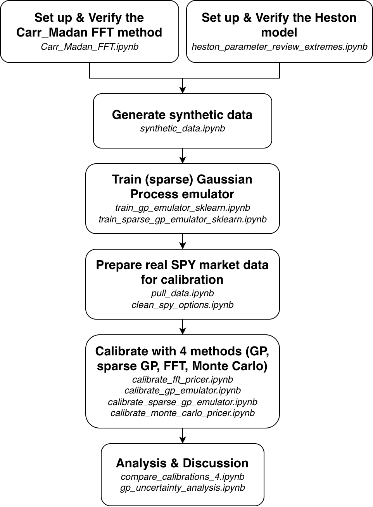

# HestonGP

This repository contains code for calibrating the Heston stochastic volatility model and comparing pricing/calibration approaches based on FFT, Monte Carlo, and Gaussian Process emulators.

## Repository Structure

- `Document_HestonGP.pdf` - written project document
- `code/` - notebooks, scripts, data, trained emulator artifacts, and generated outputs
- `code/data/` - SPY option data and synthetic Heston implied-volatility data
- `code/outputs/` - calibration summaries, validation metrics, model files, and comparison results
- `README.md` - project overview and usage notes

## Main Workflow

1. Pull and clean SPY option data.
2. Generate or load synthetic Heston training data.
3. Train GP or sparse GP emulators for implied volatility.
4. Calibrate Heston parameters using FFT, Monte Carlo, GP, and sparse GP methods.
5. Compare calibration accuracy and runtime across methods.
   
 

  

## Requirements

The code is written in Python and uses Jupyter notebooks. Main dependencies include:

- `numpy`
- `pandas`
- `scipy`
- `scikit-learn`
- `matplotlib`
- `yfinance`

Install the dependencies in your preferred Python environment before running the notebooks.

## Outputs

Generated outputs are saved under `code/outputs/`. These include calibration summaries, per-contract predictions, validation metrics, trained emulator files, and comparison tables.
